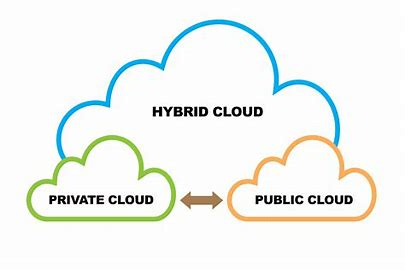

## Hybridcloud

1. Definition:

Eine Hybrid Cloud ist eine Cloud-Computing-Umgebung, die die Kombination aus öffentlichen und privaten Clouds umfasst, wodurch Daten und Anwendungen zwischen ihnen verschoben werden können.

2. Hauptmerkmale:

Kombination von Clouds: Integration von Public und Private Cloud-Ressourcen.
Daten- und Anwendungsportabilität: Flexibilität, um Anwendungen und Daten zwischen Clouds zu verschieben.
Zusätzliche Kontrolle: Private Cloud für sensible Daten und Public Cloud für skalierbare Ressourcen.

3. Vorteile:

Flexibilität: Optimale Nutzung von Public- und Private-Cloud-Vorteilen.
Skalierbarkeit: Skalierung von Ressourcen je nach Anforderungen.
Sicherheit und Compliance: Kontrolle über sensible Daten in der Private Cloud.

4. Herausforderungen:

Komplexität: Verwaltung von Ressourcen in verschiedenen Cloud-Umgebungen.
Datensicherheit: Sicherstellung der sicheren Datenübertragung und -speicherung zwischen den Clouds.
Kosten: Monitoring und Optimierung der Kosten in beiden Umgebungen.