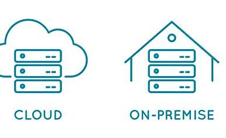

## On Premise

1. Definition:

On-Premise, auch als On-Premises oder On-Premises-Deployment bezeichnet, bezieht sich auf die Bereitstellung von IT-Ressourcen, Anwendungen und Systemen auf lokalen Servern in den Räumlichkeiten einer Organisation.

2. Hauptmerkmale:

Lokale Bereitstellung: Hardware und Software sind physisch in den Unternehmensräumen vorhanden.
Volle Kontrolle: Die Organisation hat volle Kontrolle über die gesamte IT-Infrastruktur.
Datensicherheit: Direkte Kontrolle über sensible Daten und Sicherheitsmaßnahmen.

3. Vorteile:

Volle Kontrolle: Organisation behält die volle Kontrolle über Hardware, Software und Daten.
Sicherheit: Hohe Datensicherheit durch physische Kontrolle und Zugangsbeschränkungen.
Anpassbarkeit: Anpassung an spezifische Anforderungen und branchenspezifische Standards.

4. Herausforderungen:

Kosten: Hohe Anfangsinvestitionen für Hardware, Software und Wartung.
Skalierbarkeit: Möglicherweise schwieriger zu skalieren als Cloud-Lösungen.
Wartungsaufwand: Interne Ressourcen für Wartung und Aktualisierung erforderlich.