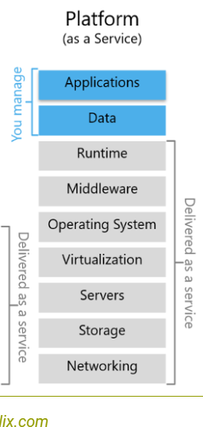

## PaaS Platform as a Service

1. Definition:

Platform as a Service (PaaS) ist ein Cloud-Computing-Modell, das eine Plattform mit integrierten Tools und Diensten für die Anwendungsentwicklung und Bereitstellung bereitstellt.

2. Hauptmerkmale:

Entwicklungsframeworks: Vordefinierte Tools und Frameworks für die Anwendungsentwicklung.
Datenbanken: Integrierte Datenbankdienste für effiziente Datenverwaltung.
Hosting: Automatisiertes Bereitstellen von Anwendungen ohne Servermanagement.

3. Vorteile:

Zeitersparnis: Schnellere Entwicklung und Bereitstellung von Anwendungen.
Skalierbarkeit: Automatische Skalierung je nach Anforderungen.
Wartungsfreiheit: Plattform übernimmt Aufgaben wie Serverwartung und Patching.