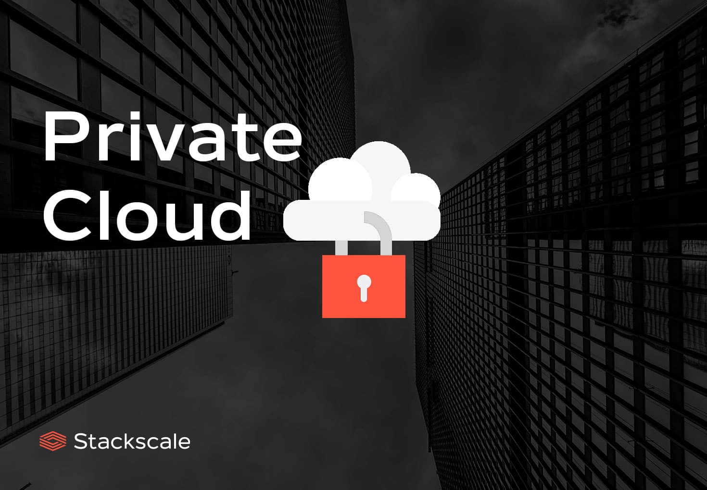

## Private Cloud

1. Definition:

Eine private Cloud ist eine Cloud-Computing-Infrastruktur, die exklusiv für eine einzelne Organisation bereitgestellt wird. Sie kann intern (on-premises) oder extern (gehört einem Drittanbieter) betrieben werden.
2. Hauptmerkmale:

Exklusivität: Nutzung durch eine einzelne Organisation.
Kontrolle: Direkte Kontrolle über Hardware, Netzwerk und Daten.
Sicherheit: Verbesserte Sicherheitskontrollen und Datenschutz.

3. Bereitstellungsmodelle:

On-Premises Private Cloud: Innerhalb der Organisation betrieben.
Externally Hosted Private Cloud: Durch einen Drittanbieter bereitgestellt.

4. Vorteile:

Sicherheit: Bietet höhere Kontrolle und Sicherheit über Daten.
Anpassbarkeit: Flexibilität für individuelle Anforderungen und Konfigurationen.
Compliance: Erfüllt branchenspezifische und rechtliche Anforderunge

5. Herausforderungen:

Kosten: Kann teurer sein aufgrund von Infrastrukturinvestitionen.
Wartung: Erfordert interne Ressourcen für Wartung und Aktualisierung.
Skalierbarkeit: Möglicherweise nicht so leicht skalierbar wie öffentliche Clouds.