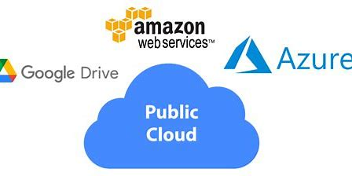

## Public Cloud

Public Cloud Cheat Sheet

1. Definition:

Eine Public Cloud ist eine Cloud-Computing-Infrastruktur, die von einem Drittanbieter betrieben wird und über das Internet für die Öffentlichkeit zugänglich ist.

2. Hauptmerkmale:

Öffentlicher Zugang: Allgemein zugänglich für verschiedene Organisationen und Benutzer.
Shared Resources: Ressourcen werden von mehreren Benutzern geteilt.
Skalierbarkeit: Elastische Ressourcen, die sich je nach Bedarf skalieren lassen.

3. Dienstmodelle:

Infrastructure as a Service (IaaS): Virtuelle Maschinen, Speicher, Netzwerke.
Platform as a Service (PaaS): Entwicklungsfunktionen, Datenbanken, Hosting.
Software as a Service (SaaS): Anwendungen, die über das Internet bereitgestellt werden.

4. Vorteile:

Kosteneffizienz: Keine Notwendigkeit für eigene Infrastrukturinvestitionen.
Skalierbarkeit: Ressourcen können bei Bedarf einfach skaliert werden.
Flexibilität: Zugang zu einer Vielzahl von Diensten und Technologien.

5. Herausforderungen:

Sicherheitsbedenken: Teilen von Ressourcen und Daten mit anderen Benutzern.
Abhängigkeit vom Anbieter: Vertrauen in die Zuverlässigkeit und Sicherheit des Anbieters.
Eingeschränkte Anpassbarkeit: Weniger Anpassungsmöglichkeiten im Vergleich zu Private Clouds.